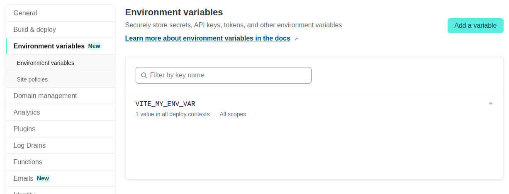
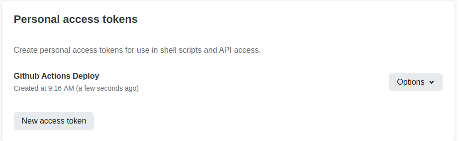
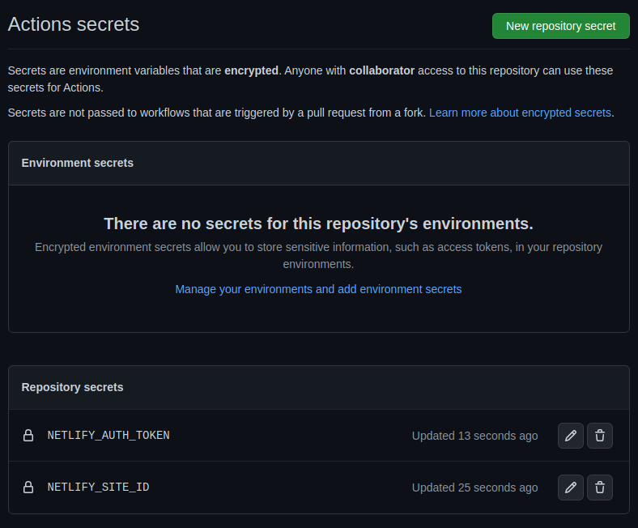

# Prepare Mobile Apps Netlify Deploy

## Deployment on Netlify

1. Setup a netlify.toml file to specify how the site should be build

```toml
[build]
  command = "npm run build"
  publish = "dist"
  environment = { NODE_VERSION = "18.8.0", NPM_VERSION = "8.18.0" }
```

2. Fix the refresh on `/about` (basically surfing directly to routes in SPA's)

You can create a file called `_redirects` in `dist` (needs to be taken into account when building the app) with the content below:

```
# Fixing Single Page Web app routes
/*    /index.html   200
```

Or you can add the redirect to the `netlify.toml` file:

```toml
[[redirects]]
  from = "/*"
  to = "/index.html"
  status = 200
  force = false
```

More info @ [https://docs.netlify.com/routing/redirects/](https://docs.netlify.com/routing/redirects/),

### Fixing CORS on Netlify

Source: [https://developer.mozilla.org/en-US/docs/Web/HTTP/CORS](https://developer.mozilla.org/en-US/docs/Web/HTTP/CORS)

I expected us to get CORS problems here, but we don't. Backend is configured to allow all cors but that was not enough in the past.

Anyways, if problems would arise here is a Netlify solution.

```toml
[[redirects]]
  from = "/api/*"
  to = "https://dust.devbitapp.be/api/:splat"
  status = 200
  force = true
```

An asterisk indicates a splat that will match anything that follows it. You can use the splat in your rewrites.

**Make sure to place this before the `/*` redirect!**

More info @ [https://docs.netlify.com/configure-builds/file-based-configuration/#redirects](https://docs.netlify.com/configure-builds/file-based-configuration/#redirects).

Of course you will need to make your API calls to `/api` from now on and not the actual dust endpoint.

## Environment Variables

Vite: [https://vitejs.dev/guide/env-and-mode.html](https://vitejs.dev/guide/env-and-mode.html)

So you can create `.env` files for development `.env.development` with the following content for example:

```
VITE_MY_ENV_VAR="You are working in dev mode"
```

**Make sure it starts with `VITE_` so vite replaces it when building the site**.

Than we can use it inside our app:

```vue
<script setup lang="ts">
// ....

const envVar = import.meta.env.VITE_MY_ENV_VAR
</script>

<template>
  <div class="about">
    <h1>This is an about page</h1>
    <div>Environment variable: {{ envVar }}</div>

<!-- .... -->

</template>
```

Of course when we deploy on netlify we need to be able to set the ENV var there too.

Netlify allows you to do just that:



Do note that this env var is used when the site is being build by netlify.

### API End Point

This allows us to configure the API end point for both development and production.

In `.env.development`

```
VITE_MY_ENV_VAR="You are working in dev mode"
VITE_API_ENDPOINT=https://dust.devbitapp.be/api
```

And on netlify:

```
VITE_API_ENDPOINT=/api
```

Now we just need to tweak our API calls:

```vue
<script setup lang="ts">
// ...

const baseURL = import.meta.env.VITE_API_ENDPOINT
const api = axios.create({
  baseURL: baseURL
})

onMounted(() => {
  api.get('/trees')
  .then((response) => {
    // console.log(response)
    trees.value = response.data.data;
  })
  .catch((err) => {
    // console.log("failed to get response");
    error.value = err.message;
  })
})

const envVar = import.meta.env.VITE_MY_ENV_VAR
</script>

<template>
  <div class="about">
    <h1>This is an about page</h1>
    <div>Environment variable: {{ envVar }}</div>
    <div>API EndPoint: {{ baseURL }}</div>

  <!-- ... -->
</template>

```

#### Vite Proxy

Another option is to use VITE to proxy the api locally. This can be useful for development.

```ts
// ...

export default defineConfig({
  // ...
  server: {
    proxy: {
      '/api': {
        target: 'https://dust.devbitapp.be/api',
        changeOrigin: true,
        rewrite: (path) => path.replace(/^\/api/, '')
      },
    }
  }
})
```

Of course then both in development and production the API is accessible via `/api` and no env var is needed anymore.

Or you could play it all safe and allow for an env var but use `/api` as fallback:

```ts
const baseURL = import.meta.env.VITE_API_ENDPOINT || '/api'
```

## Private Repos

As of september 2022, netlify does not allow free accounts to deploy websites from a private repo. This can be fixed by using Github actions to build the web site into static files and push them to netlify.

To use github actions we need to create a yaml file in `.github/workflows`. Let's call the file `build_production.yml`:

```yaml
name: Build Vue3 Site

on:
  push:
    branches: [ master ]

env:
  VITE_MY_ENV_VAR: "This comes from the github action"

jobs:
  build:
    runs-on: ubuntu-latest
    timeout-minutes: 5

    steps:
      - name: Checkout code
        uses: actions/checkout@v3

      - name: ✨ Setup Node.js environment
        uses: actions/setup-node@v3
        with:
          node-version: 18.x

      - name: Install Dependencies
        run: npm install

      - name: Build dist
        run: npm run build

        # https://github.com/nwtgck/actions-netlify
      - name: Deploy to Netlify
        uses: nwtgck/actions-netlify@v1.2
        with:
          production-deploy: true
          publish-dir: './dist'
          deploy-message: "${{ github.event.head_commit.message }}"
        env:
          NETLIFY_AUTH_TOKEN: ${{ secrets.NETLIFY_AUTH_TOKEN }}
          NETLIFY_SITE_ID: ${{ secrets.NETLIFY_SITE_ID }}
```

Next you will need to setup a personal access token on netlify via [https://app.netlify.com/user/applications#personal-access-tokens](https://app.netlify.com/user/applications#personal-access-tokens).



The netlify site ID can be found at `team page > your site > Settings > Site details > Site information > API ID`

You need to set these secrets on GitHub via `repo => Settings => Secrets`.



You should also stop the build process on netlify: `Site Settings => Build & deploy => Build Settings`.

Also change the `netlify.toml` config file as such:

```toml
[build]
  publish = "dist"
```

Also unlinked the repo in `Site Settings => Build & deploy => Continuous Deployment`.

### API Redirects

Another problem arises now. Apparently the redirects in the `netlify.toml` are not processed anymore.

Fixed by copying the `netlify.toml` file to `./dist` after building.

```yml
name: Build Vue3 Site

on:
  push:
    branches: [ master ]

env:
  VITE_MY_ENV_VAR: "This comes from the github action"

jobs:
  build:
    runs-on: ubuntu-latest
    timeout-minutes: 5

    steps:
      - name: Checkout code
        uses: actions/checkout@v3

      - name: ✨ Setup Node.js environment
        uses: actions/setup-node@v3
        with:
          node-version: 18.x

      - name: Install Dependencies
        run: npm install

      - name: Build dist
        run: npm run build

      - name: Copy netlify.toml
        run: cp netlify.toml ./dist

        # https://github.com/nwtgck/actions-netlify
      - name: Deploy to Netlify
        uses: nwtgck/actions-netlify@v1.2
        with:
          production-deploy: true
          publish-dir: './dist'
          deploy-message: "${{ github.event.head_commit.message }}"
        env:
          NETLIFY_AUTH_TOKEN: ${{ secrets.NETLIFY_AUTH_TOKEN }}
          NETLIFY_SITE_ID: ${{ secrets.NETLIFY_SITE_ID }}

```

## How About Docker

We can also create a docker image which contains the build version of our web application which can then be deployed on any server. Below is a docker file that does just this.

```dockerfile
# Development Stage
FROM node:18.10.0-alpine3.15 as develop-stage
WORKDIR /app
COPY package*.json ./
RUN npm install
COPY . .

# Build Stage
FROM develop-stage as build-stage
RUN npm run build

# Production Stage
FROM nginx:1.23.1-alpine as production-stage
COPY --from=build-stage /app/dist /usr/share/nginx/html
COPY nginx.conf /etc/nginx/nginx.conf
EXPOSE 80
CMD ["nginx", "-g", "daemon off;"]
```

You will also need to provide the `nginx.conf` file. That way we can setup the redirection for the router:

```conf
user  nginx;
worker_processes  1;
error_log  /var/log/nginx/error.log warn;
pid        /var/run/nginx.pid;
events {
  worker_connections  1024;
}
http {
  include       /etc/nginx/mime.types;
  default_type  application/octet-stream;
  log_format  main  '$remote_addr - $remote_user [$time_local] "$request" '
                    '$status $body_bytes_sent "$http_referer" '
                    '"$http_user_agent" "$http_x_forwarded_for"';
  access_log  /var/log/nginx/access.log  main;
  sendfile        on;
  keepalive_timeout  65;
  server {
    listen       80;
    server_name  localhost;
    location / {
      root /usr/share/nginx/html;
      index  index.html;
      try_files $uri $uri/ /index.html;
    }
    error_page   500 502 503 504  /50x.html;
    location = /50x.html {
      root   /usr/share/nginx/html;
    }
  }
}
```

And last but not least, automatic docker image build using a github workflow:

```yaml
name: Docker

on:
  push:
    # Publish `master` as Docker `latest` image.
    branches:
      - master

    # Publish `v1.2.3` tags as releases.
    tags:
      - v*

  # Run tests for any PRs.
  pull_request:

env:
  IMAGE_NAME: mobile-apps-dust-frontend

jobs:
  # Push image to GitHub Packages.
  # See also https://docs.docker.com/docker-hub/builds/
  push:
    runs-on: ubuntu-latest
    timeout-minutes: 10   # Default is 360
    if: github.event_name == 'push'

    steps:
      - uses: actions/checkout@v3

      - name: Build image
        run: docker build . --file Dockerfile --tag $IMAGE_NAME

      - name: Log into registry
        run: echo "${{ secrets.GITHUB_TOKEN }}" | docker login docker.pkg.github.com -u ${{ github.actor }} --password-stdin

      - name: Push image
        run: |
          IMAGE_ID=docker.pkg.github.com/${{ github.repository }}/$IMAGE_NAME

          # Change all uppercase to lowercase
          IMAGE_ID=$(echo $IMAGE_ID | tr '[A-Z]' '[a-z]')

          # Strip git ref prefix from version
          VERSION=$(echo "${{ github.ref }}" | sed -e 's,.*/\(.*\),\1,')

          # Strip "v" prefix from tag name
          [[ "${{ github.ref }}" == "refs/tags/"* ]] && VERSION=$(echo $VERSION | sed -e 's/^v//')

          # Use Docker `latest` tag convention
          [ "$VERSION" == "master" ] && VERSION=latest

          echo IMAGE_ID=$IMAGE_ID
          echo VERSION=$VERSION

          docker tag $IMAGE_NAME $IMAGE_ID:$VERSION
          docker push $IMAGE_ID:$VERSION
```

You can test this locally by running an instance of the image:

```bash
docker pull ghcr.io/xxxxxxxxxxxxxxxxxxxxxxxxxxxxxxxxxxxxx/mobile-apps-dust-frontend:latest
docker run --rm -p 80:80 ghcr.io/xxxxxxxxxxxxxxxxxxxxxxxxxxxxxxxxxxxxx/mobile-apps-dust-frontend:latest
```

You can find the exact package name on the page of your github repo.

### Environment Variables

Not working as I thought it would.